# 🫁 Unity VO₂ CSV Logger (Polar Stream → CSV → Python VO₂ Prediction/Calibration)


> **운동(재활) 콘텐츠 실행 중, 모바일(안드로이드)에서 전송되는 HR/VO₂ 스트림을 PC(Unity)가 HTTP로 수집해 CSV로 저장하고, 종료 시 Python 모델로 VO₂ 예측/보정 결과 CSV를 생성하는 End-to-End 로깅/후처리 파이프라인 프로젝트입니다.**

<br/>

## 📸 Project Showcase


<br/>

## 📝 Introduction
이 프로젝트는 “CSV 저장”에 그치지 않고, 실험/공인시험 환경을 고려해 다음을 하나의 실행 흐름으로 통합했습니다.

- **PC(Unity)가 Ingest 서버(HTTP Listener)를 열고**, 모바일에서 올라오는 스트림을 세션 단위 CSV로 누적 저장
- 저장 시 **isoTime/phase/motion_id/subject** 등 분석 친화 컬럼을 함께 기록
- 종료 시 Unity에서 **Python 예측/보정 스크립트를 자동 실행**하여 결과 CSV를 생성하고 세션 파일명으로 정리

### Key Features
- **HTTP Ingest Server (PC)**: `HttpListener`로 `POST /ingest` 수신
- **Session CSV Logging**: 사용자/운동 코드 기반 파일명 생성 + 헤더 자동 구성
- **Phase/Motion Labeling**: `REST/ACTIVE` + 운동 코드(a/b/c/d) + subject 컬럼 기록
- **Python VO₂ Prediction/Calibration**: Unity에서 Python 실행 → 결과 파일 자동 rename
- **UDP Control (PC→Mobile)**: START/STOP/MARK 신호 전송으로 측정/기록 흐름 제어

<br/>

## 🏗 System Architecture (Ingest → Log → Predict Pipeline)

모바일 스트리밍 로그 수집부터 예측/보정 결과 생성까지의 전체 파이프라인입니다.

```mermaid
%%{
  init: {
    'flowchart': { 'nodeSpacing': 50, 'rankSpacing': 100, 'arrowMarkerAbsolute': true, 'arrowMarkerSize': 20 },
    'theme': 'base',
    'themeVariables': {
      'primaryColor': '#ffffff',
      'primaryTextColor': '#000000',
      'primaryBorderColor': '#000000',
      'lineColor': '#000000',
      'secondaryColor': '#ffffff',
      'tertiaryColor': '#ffffff',
      'background': '#ffffff',
      'mainBkg': '#ffffff',
      'nodeBorder': '#000000',
      'clusterBkg': '#ffffff',
      'clusterBorder': '#000000',
      'defaultBkg': '#ffffff',
      'titleColor': '#000000',
      'edgeLabelBackground':'#ffffff',
      'fontSize': '16px'
    }
  }
}%%
flowchart LR
    classDef input fill:#ffffff,stroke:#1d4ed8,stroke-width:2px,color:#000000,rx:5,ry:5;
    classDef process fill:#ffffff,stroke:#16a34a,stroke-width:2px,color:#000000,rx:5,ry:5;
    classDef engine fill:#ffffff,stroke:#000000,stroke-width:2px,color:#000000,rx:5,ry:5;
    classDef output fill:#ffffff,stroke:#7c3aed,stroke-width:2px,color:#000000,rx:5,ry:5;

    subgraph Phone["Mobile (Android)"]
      direction TB
      Stream["HR/VO₂ Stream<br/>(CSV lines)"]:::input
      Ctrl["UDP Control Listener<br/>(START/STOP/MARK)"]:::input
    end

    subgraph Unity["PC (Unity App)"]
      direction TB
      Http["HttpListener Ingest Server<br/>POST /ingest"]:::engine
      Transform["Transform/Enrich<br/>isoTime + phase + motion_id + subject"]:::process
      Csv["Session CSV Append<br/>(C:/rehab_logs/...)"]:::engine
      UI["UI Display (HR 등)<br/>(Optional)"]:::engine
    end

    subgraph Post["Post-processing"]
      direction TB
      Py["Python Runner<br/>(VO₂ predict + calibrate)"]:::process
      Out["Output CSV<br/>(rename to session filename)"]:::output
    end

    Stream -->|HTTP POST| Http --> Transform --> Csv
    Transform -.-> UI
    Csv --> Py --> Out

    Unity -.->|UDP START/STOP/MARK| Ctrl

    linkStyle default stroke-width:3px,stroke:black;
```



<br/>

## 🛠 Tech Stack

| Category                | Technology                 | Description                                                       |
| ----------------------- | -------------------------- | ----------------------------------------------------------------- |
| **Engine**              | Unity 2021.3.45f1 (LTS)    | 씬/UI/로그 저장 및 파이프라인 실행                                             |
| **Language**            | C#                         | HTTP/UDP 통신, CSV 로깅, 후처리 트리거                                      |
| **Ingest (PC)**         | .NET `HttpListener`        | `POST /ingest`로 스트림 수신 (`SceneIngestServer.cs`, `HrCollector.cs`) |
| **Control (PC→Mobile)** | UDP (`UdpClient`)          | START/STOP/MARK 제어 신호 전송 (`HrCollector.cs`)                       |
| **Logging**             | CSV (UTF-8)                | 세션 단위 파일 생성/append, 분석용 컬럼 추가                                     |
| **Post-process**        | Python 실행 + Artifact(.pkl) | 예측/보정 스크립트 실행 후 결과 CSV 생성/정리 (`VO2Bridge.cs`)                     |

<br/>

## 📂 Implementation Details

### 1. PC Ingest Server (HTTP Listener)
- Unity(PC)가 POST /ingest 엔드포인트를 열고, 모바일에서 전송되는 body를 수신합니다.
- 주요 스크립트:
  - Assets/Scripts/SceneIngestServer.cs : 세션 파일 생성/헤더 작성/변환 후 append
  - Assets/Scripts/HrCollector.cs : 간단 ingest 서버 + START/STOP/MARK UDP 제어(대안/테스트용)

### 2. Session CSV Naming & Enrichment
- 사용자명(PlayerPrefs: UserName)과 운동 코드(a/b/c/d)를 조합해 세션 파일명을 생성합니다.
- 원본 epochMs를 isoTime(yyyy-MM-dd HH:mm:ss)로 변환하고, phase(REST/ACTIVE), motion_id(a/b/c/d), subject(사용자) 컬럼을 덧붙여 저장합니다.
- 세션 CSV 경로는 PlayerPrefs("LastPolarCsvPath")로 저장되어 후처리 단계에서 재사용됩니다..

### 3. Phase / Motion ID 처리
- SharedPhase.Current 값을 읽어 현재 구간을 REST/ACTIVE로 라벨링합니다.
- 운동명(한글)을 내부 코드(a/b/c/d)로 매핑해 motion_id로 기록합니다.
  예: 오픈캔→a, 검빼듯→b, 내회전→c, 외회전→d

### 4. Python VO₂ Prediction / Calibration (Unity에서 자동 실행)
- Assets/Scripts/VO2Bridge.cs가 Python을 실행해 예측 결과를 생성합니다.
- 실행 옵션 예시(코드에 반영):
  - --predict-from-polar {csv}
  - --load-artifact {model_artifact.pkl}
  - --out {outDir}
  - --ref-table {ref_table.csv}
  - --calibrate-active-only 1
  - --use-bias-head 0
  - --polar-time-col "isoTime"
- Python이 기본으로 생성한 pred_from_polar.csv를 원본 세션 CSV 파일명으로 rename하여 관리합니다.

### 5. Scene-based Experience Flow
- Assets/Scripts/ExitAndPredict.cs에서 종료 버튼 클릭 시 예측 실행 → 성공/실패/타임아웃 처리 → 종료 정책(실패해도 종료 옵션)까지 담당합니다.

<br/>

## 🏆 Project Outcomes
- 모바일 스트림 수집(HTTP) → 세션 로그 정리(CSV) → Python VO₂ 예측/보정을 하나의 실행 파이프라인으로 통합했습니다.
- 실험 분석에 필요한 isoTime/phase/motion_id/subject 컬럼을 로그에 포함해 후속 분석/학습 투입을 단순화했습니다.
- 종료 시 Unity에서 Python을 자동 실행하고 결과 파일을 세션 단위로 정리하여 운영/재현성을 확보했습니다.

<br/>

## 🚀 How to Run
1. Clone this repository.
```bash
   git clone https://github.com/wns5255/unity-vo2-csv-logger.git
```
2. Unity로 프로젝트 열기
  * Unity 2021.3.45f1 LTS 권장

3. Unity로 프로젝트 열기
  * SceneIngestServer.cs 또는 HrCollector.cs에서 포트/저장 경로 확인
  * 예: http://PC_IP:5555/ingest, C:/rehab_logs/...

4. 모바일(안드로이드) 연동
  * 모바일 앱이 POST /ingest로 CSV 라인을 전송하도록 구성
  * Unity에서 UDP로 START|{pcUrl}|{weight}|{vo2max}|... 제어 신호 전송 가능

5. 예측/보정 실행
  * VO2Bridge.cs의 Python 경로/스크립트/아티팩트/Ref Table/outDir을 환경에 맞게 설정
  * 종료 버튼(예: ExitAndPredict)을 통해 예측 실행 후 종료 가능


<br/>

## ⚠️ Notes
* Windows에서 HttpListener는 포트/URLACL 권한 이슈가 발생할 수 있습니다(포트 충돌, 방화벽, URL 예약 등)
* VO2Bridge.cs는 로컬 경로 설정에 의존하므로, 배포/재현을 위해 설정 파일/환경변수 분리가 권장됩니다
* 실시간 스트림은 네트워크 지연/손실에 영향을 받으므로 필요 시 버퍼링/재전송 정책을 추가하는 것을 권장합니다

<br/>

## ⚖️ License
Copyright (c) Soongsil University. All Rights Reserved.

This project was developed as part of a curriculum or research at Soongsil University.
The intellectual property and copyright of this software belong to Soongsil University.
Unauthorized commercial use or distribution is prohibited.
